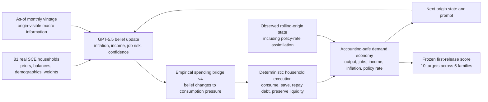

# LLM macro forecast tournament

Research code for running as-of macro forecast tournaments against public Survey of Professional Forecasters data and simple statistical controls.

Start with [`CURRENT.md`](CURRENT.md) for the current runnable surface. The repository contains the reusable harness, plus one current handoff report at [`reports/macro_simulation_report.md`](reports/macro_simulation_report.md). Generated run reports, model outputs, caches, and research notes are local artifacts and are not part of the public source tree.

## How the simulated economy works

The current system is a recursive, rolling-origin matched-twin economy. Real
household data supplies the heterogeneity; GPT-5.5 updates beliefs; measured
code converts beliefs into actions and owns feasibility; the simulated macro
state becomes part of the next period's information set.



The control replaces only the GPT belief updater with adaptive expectations.
It uses the same households, bridge, economy, information, accounting, and
targets. Adaptive is therefore a strong dumb benchmark: any difference isolates
the value of LLM belief updating inside the simulated economy.

Raw LLM actions are not used. Direct allocations lost to a liquidity rule, and
profile-only or backstory personas failed on real SCE heterogeneity. The LLM is
used where the experiments found signal: updating supplied beliefs and authoring
bounded policy schedules. Deterministic code executes the consequences.

### Current recursive result

The January-May 2026 development run starts from 81 SCE households, uses
January as a warmup month, and scores February-May on 40 post-cutoff,
first-release target rows. The selected full-assimilation candidate scores
`0.549789`; adaptive scores `0.548667`. Lower is better. The LLM economy is
`0.2%` behind, statistically indistinguishable on this four-origin sample, but
`2.61%` better than the base recursive LLM economy.

This is a working simulatable macroeconomy and a developmental near-tie, not a
confirmed predictive win. The exact winner is frozen for a one-shot June 2026
test. That command remains blocked until the complete 10-target first-release
bundle is available, expected with the [BEA June Personal Income and Outlays
release on July 30, 2026](https://www.bea.gov/news/schedule/).

Replay the selected January-May economy without provider calls:

```bash
make dynamic-macro-incumbent-replay
```

## What is in the repo

- `src/macro_llm_tournament/forecast_tournament.py` builds and scores SPF-style forecast tournaments.
- `src/macro_llm_tournament/forecast_audit.py` audits completed tournament runs for reviewer checks: direct realized-value recall, qualitative path recall, surprise splits, Theil's U, paired loss gaps, and belief-structure diagnostics.
- `src/macro_llm_tournament/forecast_cards.py` creates as-of prompt cards with hidden realized outcomes and hidden same-card SPF consensus.
- `src/macro_llm_tournament/forecast_controls.py` implements no-change, rolling mean, AR, recursive least-squares, constant-gain, extrapolative, diagnostic, and official SPF benchmark controls.
- `src/macro_llm_tournament/fred_vintage.py` adds FRED/ALFRED real-time macro context when `FRED_API_KEY` is available.
- `src/macro_llm_tournament/survey_beliefs.py` loads household belief context from NY Fed SCE chart data and Michigan/FRED inflation expectations.
- `src/macro_llm_tournament/forecast_agent_panel.py` maps forecasts into a typed household-panel scaffold without spending extra LLM calls.
- `src/macro_llm_tournament/agent_economy.py` runs the forecast-first typed agent economy CLI.
- `src/macro_llm_tournament/agent_llm.py`, `agent_runtime.py`, `agent_types.py`, `agent_targets.py`, and `agent_report.py` hold the LLM-agent schema, accounting runtime, SCF-style type cells, origin-level household-belief scoring, and report rendering.
- `src/macro_llm_tournament/behavior_gate.py` scores typed household agents against a packaged public stimulus-response target catalog for aggregate MPC, liquidity gradients, debt repayment, liquid saving, directional debt/saving gradients by liquidity, and cell-level MPC-by-liquidity targets; unverified direct-target gaps stay unscored.
- `src/macro_llm_tournament/behavior_ecology.py` runs the individual-household behavior ecology: concrete seeded households answer one shock each in the first person (dollars, not shares), a policy arm elicits response schedules evaluated by code, and pre-registered differentiation metrics test whether elicitation compression survives. It can also replay already-banked policy schedules on fresh behavior families such as the CTC holdout without new model calls.
- `src/macro_llm_tournament/state_policy_schedules.py` builds state-conditioned behavior-policy profiles. A live model writes bounded schedules over household balance sheets and belief gaps; the demand economy later interpolates those schedules and owns budget/accounting feasibility.
- `src/macro_llm_tournament/persona_belief_panel.py` runs data-grounded persona belief panels and scores cross-sectional gradients, within-group spread, distribution distance, and common-core correlation.
- `src/macro_llm_tournament/persona_ecology.py` runs respondent-seeded belief ecologies with profile, prior-expectation, external-information, behavior, and aggregate-feedback modules.
- `src/macro_llm_tournament/demand_economy.py` runs the abstract HANK-lite demand economy: household belief modules form inflation, income, job-risk, confidence, and precautionary-saving beliefs; deterministic structural code converts those beliefs into budget-constrained consumption, aggregate demand, output, employment, sticky inflation, and policy feedback.
- `src/macro_llm_tournament/demand_vintage_oos.py` builds date-free vintage demand cards, hidden targets, baseline forecasts, leakage audits, and OOS score summaries.
- `src/macro_llm_tournament/belief_calibration.py` fits validation-only belief-dynamics calibration, scores the locked transform on held-out vintage cards, and emits a bounded behavior-economy calibration profile.
- `src/macro_llm_tournament/macro_playground.py` wraps the demand kernel in a branchable scenario sandbox with bounded household, firm, policy/narrative, and critic actor payloads.
- `src/macro_llm_tournament/macro_tournament.py` runs retrospective full-economy candidate tournaments and replays the promoted incumbent without spending fresh score surfaces.
- `src/macro_llm_tournament/prepare_dynamic_macro_panel.py` builds the leakage-audited 81-household SCE state used by the recursive economy.
- `src/macro_llm_tournament/frozen_vintage_bundle.py` freezes and validates rolling-origin first-release FRED/ALFRED bundles.
- `src/macro_llm_tournament/dynamic_macro_economy.py` runs the recursive matched twins, feedback, accounting, and common-month macro scoring.
- `src/macro_llm_tournament/dynamic_macro_tournament.py` compares complete recursive economies on locked developmental surfaces and preserves live-call/replay provenance.
- `src/macro_llm_tournament/dynamic_macro_confirmatory.py` owns the fail-closed, one-shot June confirmation lock and receipt.
- `src/macro_llm_tournament/macro_performance_gate.py` scores the macro lab and vintage OOS artifacts against an executable target catalog without promoting fixture runs to empirical validity.
- `src/macro_llm_tournament/macro_validity.py` is the legacy mechanism-readiness scorecard; its OOS rows are static gaps. Use `macro_performance_gate.py` for executable OOS readiness.
- `src/macro_llm_tournament/postcutoff_behavior_gate.py` runs the contamination-clean post-cutoff household behavior proxy gate using public FRED spending, saving, and revolving-credit series.

## Quick start

Create an environment and install the base dependencies:

```bash
python3 -m venv .venv
source .venv/bin/activate
python3 -m pip install -r requirements.txt
```

Run the local contract (syntax/diff checks, then tests):

```bash
make all
```

Run a zero-cost fixture forecast tournament:

```bash
PYTHONPATH=src python3 -m macro_llm_tournament.forecast_tournament \
  --llm-mode fixture \
  --card-count 8 \
  --vintage-context best_effort \
  --belief-targets best_effort \
  --typed-agent-panel \
  --output-dir outputs/spf_fixture
```

This downloads public SPF/SCE/Michigan data as needed, writes local outputs under `outputs/`, and makes no live LLM calls.

After installing the package, the same runner is available as `macro-llm-forecast-tournament`.

### SPF target-period semantics

Philadelphia Fed SPF error-stat rows are dated by the forecasted period, not by the date the forecast was made. Forecast cards therefore expose `forecast_target_period` and `spf_step_ahead`; Step 1 is the one-step-ahead projection for that dated target period. Generated caches from older prompt schemas should not be reused after this field changes because card IDs intentionally change with the prompt payload.

Download the public local data bundle:

```bash
make data
```

This writes ignored files under `work/`, including SPF workbooks, survey-belief files, public FRED/ALFRED graph CSVs, and SCF public files.

After the local data bundle exists, run a zero-cost post-cutoff fixture tournament:

```bash
make postcutoff-fixture
```

This builds post-cutoff SPF cards from official SPF mean forecast files. Rows with complete FRED proxy realizations are scored immediately; incomplete rows are frozen for later rescoring.

Run the zero-cost typed agent economy fixture:

```bash
make agent-fixture
```

This derives household type cells from the local public SCF extract when available, runs the packed typed-agent fixture schema for households/firms/banks, and emits persistent agent state, desired actions, feasible actions, aggregate outcomes, accounting diagnostics, origin-level household-belief target scores, and a report under `outputs/`.

Run the zero-cost closed-loop counterfactual fixture:

```bash
make agent-counterfactual-fixture
```

This uses the residual-over-liquidity household policy, closed-loop firm/bank feedback, and named forecast shocks (`rate_hike`, `growth_slump`, `credit_crunch`) without live model calls.

Run the zero-cost household behavior target fixture:

```bash
make behavior-fixture
```

This scores SCF-style household types against public stimulus-response targets from the tax-rebate, 2008 stimulus, and 2020 EIP literature. The target gate covers aggregate MPC/spending, liquidity gradients, debt repayment, liquid saving, directional debt/saving gradients by liquidity, and a separate cell-level MPC-by-liquidity bridge.

Run the zero-cost persona belief-panel fixture:

```bash
make persona-belief-fixture
```

This builds a synthetic respondent-level micro panel, elicits fixture persona beliefs from two model labels, and scores the distributional objects that matter for the Mosaic/heterogeneity gate: adjusted demographic-gradient match, contrast diagnostics, within-group variance preservation, weighted Wasserstein/KS distribution distance, and cross-model common-core correlation. It is a fixture harness; real evidence should use `--respondent-source csv` with respondent-level SCE, Michigan, PSID, SCF, or similar microdata.

Run the zero-cost respondent ecology fixture:

```bash
make persona-ecology-fixture
```

This is the Alex/paper-spine runner. It builds a multi-period respondent panel, gives each household agent a stable profile, prior beliefs, current external information, and prior aggregate feedback, then asks for updated beliefs plus behavior. The deterministic layer aggregates those actions into demand, credit, labor, inflation, and unemployment feedback for the next period. It emits static heterogeneity scores, temporal belief-update scores, behavior scores when target behavior columns exist, module ablations, environment history, and a report. Fixture mode validates the wiring only.

Prepare the enriched persona holdout CSVs used by the live canaries:

```bash
make persona-holdouts
```

This writes `work/persona_beliefs/sce_micro_holdout.csv` and `work/persona_beliefs/sce_panel_holdout.csv` from the local public survey-belief aggregate file and `work/fred_vintage_panel/` as-of macro context. The default 54-row static panel is the minimum full fixture grid for income, education, age, and gender, so high-income and high-liquidity contrasts are present. These are synthetic enriched persona targets, not true respondent microdata. They are useful for live ecology wiring, prompt leakage checks, and closed-loop emergent-feedback canaries; empirical respondent-level claims still require real SCE, Michigan, PSID, SCF, or comparable microdata.

Run the zero-cost post-cutoff household behavior proxy fixture:

```bash
make postcutoff-behavior-fixture
```

This exercises the contamination-clean behavior runner without using live data or LLM calls.

Run the zero-cost Phase 4 matched-twin economy fixture:

```bash
make phase4-matched-twins-fixture
```

This locks the output-to-proxy mapping, runs the same accounting-constrained demand economy with an LLM-belief fixture and an adaptive-expectations twin, and writes `outputs/phase4_matched_twins_fixture/` with the mapping hash, proxy cards, twin paths, accounting, proxy forecasts, scores, manifest, and `phase4_matched_twins_report.md`. Fixture mode is a readiness gate only: live/replay mode is blocked until real prior-state household inputs and a locked replay cache are supplied.

Replay the banked Codex prior-update result through the Phase 4 matched-twin economy:

```bash
make phase4-prior-update-codex-replay
```

This consumes `outputs/persona_ecology_sce_prior_update_live_codex_gpt55_gpt54_100/`, filters to `llm_codex_cli_gpt-5.5`, builds respondent-derived household states from the real SCE panel without copying `actual_*` targets into prompts, and compares that LLM-updater economy to the adaptive-expectations twin on the locked FRED proxy mapping. Mapping v2 scores `personal_saving_rate_pct` as month-over-month change in the saving-rate proxy, applied identically to both twins and the target series. The checked-in replay target is labeled retrospective. The first mapping-v2 held-out score date has now been spent by `make macro-confirmatory-v1`; its negative result is preserved in `reports/macro_confirmatory_fred_2026_02_v1_evidence.json`, but the integrity review downgraded it from confirmatory because its FRED inputs were current-vintage rather than frozen as-of observations. The default target is the strict one-card run because the banked Codex prior-update ecology has two periods; `--ecology-period-policy hold_last` is available only as an explicitly labeled extrapolation ablation.

Run the same Phase 4 replay with the GPT-5.5 policy-schedule behavior executor:

```bash
make phase4-prior-update-policy-schedule-replay
```

This uses the banked policy schedules in `outputs/behavior_ecology_gpt55_xhigh/ecology_raw_records.json` as the shared behavior layer for both twins. The LLM-authored schedules supply conditional transfer and income-risk response functions; deterministic code matches each SCE household to the nearest SCF schedule cell, interpolates the schedule, enforces budgets, and keeps accounting. This is still retrospective because it reuses an already scored FRED month.

Score the fresh CTC behavior holdout using those already-banked schedules and zero new model calls:

```bash
make behavior-ecology-ctc-holdout-replay
```

This evaluates `ctc_2021_monthly_child_credit_style` against the new `behavior_holdout_ctc_v1` split. The CTC spending target is anchored on the BLS Consumer Expenditure estimate; saving/debt and income-gradient rows are secondary rough allocation checks from the Brookings/Social Policy Institute survey.

Build the state-conditioned behavior-policy profile through Codex CLI:

```bash
make state-policy-schedules-live
```

This makes one live Codex call by default, using the real-SCE prior-update household panel to define reusable household-state archetypes. It writes `outputs/state_policy_schedules_live_gpt55_sce_prior_update/state_behavior_policy_profile.json`.

Run Phase 4 with that state-conditioned profile as the shared behavior layer:

```bash
make phase4-prior-update-state-schedule-replay
```

This is the historical Phase 4 state-schedule bridge: real SCE heterogeneity supplies household state, the LLM-updater supplies beliefs, an LLM-authored policy profile maps state and belief gaps to behavior schedules, and deterministic code executes the schedules and aggregates the macro economy. The current recursive winner instead uses empirical bridge v4; see `CURRENT.md`.

Run the zero-cost forecast audit fixture:

```bash
make audit-fixture
```

This reruns the SPF fixture if needed, then emits reviewer-style audit files under `outputs/forecast_audit_fixture`.

Run the zero-cost macro performance gate:

```bash
make macro-performance-fixture
```

This runs the demand-economy fixture, the date-free vintage OOS fixture, and the performance gate. It writes `outputs/macro_performance_gate_fixture/` with the target catalog copy, target-level scores, variant summary, baseline attribution, vintage-readiness table, manifest, and `macro_performance_report.md`.

## Live LLM runs

Live runs are deliberately capped. A live run fails unless `--max-live-calls` is positive.

The post-cutoff gate is the main contamination-clean screen. It uses SPF detail forecast files after the model cutoff and scores rows when FRED proxy realizations are complete:

```bash
PYTHONPATH=src python3 -m macro_llm_tournament.postcutoff_tournament \
  --provider codex_cli \
  --model gpt-5.5 \
  --llm-mode live \
  --max-live-calls 9 \
  --vintage-context require \
  --belief-targets best_effort \
  --typed-agent-panel \
  --output-dir outputs/spf_postcutoff_gpt55_2026q1q2
```

Use the OpenAI Responses API directly when the model is available by API but unavailable through the local Codex CLI:

```bash
PYTHONPATH=src python3 -m macro_llm_tournament.postcutoff_tournament \
  --provider openai_responses \
  --model gpt-5 \
  --llm-mode live \
  --max-live-calls 32 \
  --cutoff-date 2024-09-30 \
  --vintage-context require \
  --belief-targets best_effort \
  --typed-agent-panel \
  --output-dir outputs/spf_postcutoff_gpt5_api
```

Use Antigravity CLI for Gemini cutoff sweeps:

```bash
PYTHONPATH=src python3 -m macro_llm_tournament.postcutoff_tournament \
  --provider antigravity_cli \
  --model gemini-3.1-pro \
  --llm-mode live \
  --max-live-calls 28 \
  --cutoff-date 2025-01-31 \
  --vintage-context require \
  --belief-targets best_effort \
  --typed-agent-panel \
  --output-dir outputs/spf_postcutoff_gemini31pro
```

Use replay mode to rescore frozen post-cutoff cards after new public data arrives without spending live calls:

```bash
PYTHONPATH=src python3 -m macro_llm_tournament.postcutoff_tournament \
  --provider codex_cli \
  --model gpt-5.5 \
  --llm-mode replay \
  --max-live-calls 0 \
  --replay-cache-miss-policy freeze \
  --previous-run-dir outputs/spf_postcutoff_gpt55_2026q1q2 \
  --vintage-context require \
  --belief-targets best_effort \
  --typed-agent-panel \
  --output-dir outputs/spf_postcutoff_gpt55_replay
```

With `--replay-cache-miss-policy freeze`, newly discovered uncached cards are written as frozen replay misses instead of spending live calls. Existing cached cards are rescored normally, and the manifest records replayed, uncached-frozen, and newly scoreable counts.

The historical tournament remains useful for scale, controls, and debugging, but its holdout is pre-cutoff:

```bash
PYTHONPATH=src python3 -m macro_llm_tournament.forecast_tournament \
  --provider codex_cli \
  --model gpt-5.5 \
  --llm-mode live \
  --max-live-calls 25 \
  --card-count 24 \
  --vintage-context require \
  --belief-targets best_effort \
  --typed-agent-panel \
  --output-dir outputs/spf_vintage_survey_agent_gpt55
```

Requirements for that run:

- `codex` CLI available on `PATH`, or set `CODEX_CLI_BIN`.
- `OPENAI_API_KEY` set in `.env` or the process environment when using `--provider openai_responses`.
- `agy` Antigravity CLI available on `PATH`, or set `ANTIGRAVITY_CLI_BIN`, when using `--provider antigravity_cli`.
- `gemini` CLI available on `PATH`, or set `GEMINI_CLI_BIN`, plus `GEMINI_API_KEY` when using the lower-level `--provider gemini_cli`.
- `FRED_API_KEY` set in `.env` or the process environment.

Copy `.env.example` to `.env` and fill in only the keys you need.

For `antigravity_cli`, use model ids such as `gemini-3.1-pro` in the tournament command. The provider temporarily selects the matching Antigravity label, for example `Gemini 3.1 Pro (High)`, under a local settings lock and restores the user's previous Antigravity setting after each call. Each cache record stores both the requested model id and the selected-label confirmation from the `agy` log.

For respondent-level holdout CSVs, prefer `openai_responses` for empirical live tests when the target model is available there: the call has no tools and no project working directory. The `codex_cli`, `antigravity_cli`, and `gemini_cli` providers are still supported for model-availability sweeps; for CSV-backed live persona runs the runner executes those providers from an isolated temporary directory and records that directory in the manifest. Fresh live persona runs require `--fresh-cache`, and the manifest records the input file hash, raw row count, normalized row count, respondent limit, and anonymization status.

Live JSON responses are retried inside the explicit live-call budget. `LLM_JSON_ATTEMPTS` defaults to `2`, so set `--max-live-calls` above the required row count when scaling beyond tiny canaries. The minimum required rows are still `respondents * models` for the static panel and `panel rows * models` for the ecology; any retry headroom is additional budget.

Provider choice for the first live sweep:

| Provider | Use for | Cleanest first role |
| --- | --- | --- |
| `openai_responses` | API-available GPT models such as `gpt-5` | First empirical holdout canaries |
| `codex_cli` | Codex-only GPT model labels such as `gpt-5.5` and `gpt-5.4` | Model-availability comparison after canary passes |
| `antigravity_cli` | Antigravity models such as `gemini-3.1-pro` | Gemini comparison after canary passes |
| `gemini_cli` | Direct Gemini CLI models such as `gemini-3.1-pro-preview` | Fallback only when direct CLI auth is known to work |

Audit any completed forecast tournament:

```bash
PYTHONPATH=src python3 -m macro_llm_tournament.forecast_audit \
  --run-dir outputs/spf_vintage_survey_agent_gpt55 \
  --recall-mode live \
  --qualitative-recall-mode live \
  --max-live-calls 1 \
  --recall-batch-size 64 \
  --qualitative-recall-batch-size 64 \
  --fresh-cache \
  --output-dir outputs/spf_vintage_survey_agent_gpt55_audit
```

The direct recall probe is deliberately separate from the forecast call. It asks the model, without tools or files, whether it remembers the realized value for each card. Use `--recall-mode fixture` for zero-cost CI and `--recall-mode replay` when a prior recall cache should be reused.

The qualitative path-recall probe is the stronger contamination check. It asks whether the model remembers the realized path direction, level versus normal, and crisis/calm status for each target quarter without showing realized values. Use `--qualitative-recall-mode fixture`, `replay`, or `live` with the same cache discipline as direct recall.

Every audit also emits `audit_belief_structure.csv` and `audit_belief_structure_summary.csv`. These files summarize underreaction, extrapolation, disagreement/dispersion, interval calibration, confidence calibration, and surprise response from the existing forecast outputs, without additional model calls.

Run a fresh-cache typed agent economy pilot after the fixture passes:

```bash
PYTHONPATH=src python3 -m macro_llm_tournament.agent_economy \
  --provider codex_cli \
  --model gpt-5.5 \
  --llm-mode live \
  --max-live-calls 9 \
  --fresh-forecast-cache \
  --agent-mode live \
  --max-agent-live-calls 32 \
  --fresh-agent-cache \
  --belief-sources llm \
  --household-policy residual_over_liquidity \
  --feedback-mode closed_loop \
  --counterfactual-shocks rate_hike,growth_slump,credit_crunch \
  --card-count 8 \
  --vintage-context require \
  --belief-targets best_effort \
  --output-dir outputs/agent_economy_gpt55_fresh
```

`--fresh-forecast-cache` and `--fresh-agent-cache` write model responses under the run output directory instead of the shared local cache, so a live pilot does not accidentally replay prior calls. `--llm-mode` controls the macro forecast calls. `--agent-mode` controls whether typed households, firms, and banks are rule-based, fixture, replayed, or live LLM agents. A fresh live counterfactual actor run needs one packed actor call per selected card and belief source, so the minimum agent cap for `8` cards with three shocks is `8 * (1 + 3) = 32`. `--household-policy residual_over_liquidity` keeps rule-based low/high liquidity response means and adds the LLM's within-group residuals. `--feedback-mode closed_loop` feeds firm hiring, price pressure, and bank credit supply back into next-origin household income and credit state. `--counterfactual-shocks` appends named forecast-shock sources for counterfactual agent runs. Even when agents are live LLMs, code still enforces budgets, credit limits, portfolio conservation, and aggregation.

Agent state advances once per SPF origin, not once per variable card. That prevents CPI, GDP, and rate cards from the same survey date from becoming artificial time steps. Household belief target scores are also origin-level, so a single future SCE or Michigan observation is counted once per origin.

Run a fresh-cache household behavior target pilot:

```bash
PYTHONPATH=src python3 -m macro_llm_tournament.behavior_gate \
  --provider codex_cli \
  --model gpt-5.5 \
  --behavior-mode live \
  --max-live-calls 3 \
  --fresh-cache \
  --output-dir outputs/behavior_gate_gpt55_fresh
```

The behavior gate uses one packed LLM call per event scenario. The deterministic layer then aggregates household-type allocations and scores them against published spending, debt-repayment, saving, liquidity-gradient, and directional debt/saving-by-liquidity moments. It also writes a separate cell-level score surface that applies public low- and high-liquidity spending-response ranges to matching SCF household types, weighted by population share.

The gate also supports `--provider cursor_cli`, which routes live calls through the headless `cursor-agent` CLI (for example `--model claude-opus-4-8-thinking-high`) so non-OpenAI models can be probed with the same prompts, cache semantics, and scoring. Cursor CLI calls run in ask mode inside an empty neutral workspace so the model cannot read repo data or targets. `--prompt-variant descriptive` swaps in a variant prompt that explicitly asks for measured (not prudent) household behavior and liquidity-first reasoning; it uses a separate prompt version so cached baseline responses are never replayed as descriptive ones.

The scored behavior targets are loaded from `src/macro_llm_tournament/data/public_behavior_targets.csv`. Aggregate and cell-level rows are separated by `target_scope`, so the aggregate scoreboard is not inflated by repeated household-cell rows. Rows marked as unscored gaps document direct targets the project still needs, such as labor response and portfolio/liquidity shifts, without letting proxy data count as evidence for them.

Run a fresh-cache persona belief-panel smoke pilot after the fixture passes and after preparing a respondent-level holdout CSV:

```bash
PYTHONPATH=src python3 -m macro_llm_tournament.persona_belief_panel \
  --provider openai_responses \
  --models gpt-5 \
  --belief-mode live \
  --max-live-calls 4 \
  --fresh-cache \
  --respondent-source csv \
  --respondent-csv work/persona_beliefs/sce_micro_holdout.csv \
  --respondent-limit 2 \
  --target-fields expected_inflation_1y \
  --output-dir outputs/persona_belief_panel_gpt5_canary
```

Use `--elicitation-mode backstory` for the single-call persona-then-answer variant. The prompt asks the model to first imagine one specific individual consistent with the profile, return a short `persona_sketch`, and then answer the belief questions as that person. It adds no hints about answer distributions, uses a separate prompt version so cached point-mode responses are never replayed as backstory responses, and records `elicitation_mode` in the manifest. The default `point` mode is unchanged.

For immediate canaries, run `make persona-holdouts` first. For empirical claims, replace those generated CSVs with licensed/publicly usable respondent-level microdata. Required columns are `respondent_id`, `weight`, `age_group`, `income_group`, `education_group`, `gender`, `region`, `employment_status`, `homeownership`, `liquid_wealth_group`, plus `actual_expected_inflation_1y`, `actual_expected_unemployment_rate`, and `actual_expected_real_income_growth`. Use the normalized labels expected by the scorer, such as `low`/`middle`/`high` income, `high_school_or_less`/`some_college`/`college_plus` education, `18_34`/`35_54`/`55_plus` age, and `female`/`male` gender. The prompt sees only the respondent profile and survey date; the actual response columns are used only for scoring. A fresh live run uses one call per respondent per model, so the live-call cap is a total cap and must cover `respondents * models`; the design-scale 500-respondent, two-model run requires about `1000` live calls. Start with the canary command above, inspect the prompt cards and manifest, then run separate provider/model batches at the target respondent count.

This is the distributional belief gate. It deliberately does not ask whether the panel improves the SPF point forecast. It asks whether data-grounded personas reproduce the cross-sectional structure of household beliefs: signs and magnitudes of adjusted demographic gradients, within-cell spread rather than stereotype flattening, full distribution distance, and whether multiple base models collapse onto the same common core. The manifest separates run status from the evidence verdict, so `status: ok` means the command completed, not that the heterogeneity gate passed.

Run a respondent-seeded ecology pilot after preparing a multi-period SCE or Michigan-style CSV:

```bash
PYTHONPATH=src python3 -m macro_llm_tournament.persona_ecology \
  --provider openai_responses \
  --models gpt-5 \
  --ecology-mode live \
  --max-live-calls 12 \
  --fresh-cache \
  --respondent-source csv \
  --survey-schema sce \
  --respondent-csv work/persona_beliefs/sce_panel_holdout.csv \
  --respondent-limit 1 \
  --target-fields expected_inflation_1y \
  --prior-mode simulated \
  --feedback-mode closed_loop \
  --output-dir outputs/persona_ecology_sce_gpt5_canary
```

Use `--date-mode relative` for a date-blind A/B run. This keeps the same respondents, priors, environment numbers, scoring targets, and feedback loop, but replaces prompt-facing calendar fields with `period_0`, `period_1`, and so on. The runner also rewrites the prompt-facing `panel_row_id` so date labels embedded in row ids cannot leak into the model prompt.

Use `--elicitation-mode backstory` when the ecology should combine empirical priors with the same specific-person elicitation used by the static persona panel. This mode has a separate prompt version, asks for a `persona_sketch`, and still hides current-period targets.

Use SCE first when possible because its rotating panel makes prior expectations and respondent-level dynamics easier to test. Use Michigan as a second distributional robustness surface. The ecology CSV can be normalized already, or passed with `--survey-schema sce` / `--survey-schema michigan` for flexible alias mapping. Required score columns are the same three held-out current beliefs as the static panel: `actual_expected_inflation_1y`, `actual_expected_unemployment_rate`, and `actual_expected_real_income_growth`. Stronger runs also include repeated respondents across at least two periods, optional `prior_*` belief columns from previous-wave answers, environment columns such as `observed_inflation_1y`, `observed_unemployment_rate`, `policy_rate`, `sentiment_index`, and optional behavior targets such as `actual_consumption_change_pct`, `actual_liquid_buffer_change_pct`, `actual_borrowing_desire_index`, `actual_portfolio_rebalance_to_liquid_pct`, and `actual_job_search_intensity_index`.

`--prior-mode simulated` uses supplied priors for the first period and then feeds each model's own previous belief outputs into the next period. `--prior-mode empirical` uses the panel's `prior_*` columns at every period, which is cleaner for survey recapitulation but less emergent. `--feedback-mode closed_loop` lets aggregate simulated behavior perturb the next period's environment; `none` runs the same agents against only exogenous period information.

The ecology cap must cover `panel rows * models`, plus any retry headroom. With `--respondent-limit 1`, a 12-call cap covers one respondent across up to twelve periods for a single model, or fewer periods with retry headroom. The runner emits period-level score files in addition to aggregate diagnostics: `persona_ecology_period_scores.csv` scores each source/model by period, `persona_ecology_update_scores.csv` scores period-to-period belief changes, and `persona_ecology_action_period_summary.csv` summarizes model-chosen behavior by period. Behavior scores become empirical behavior evidence only when the CSV includes external behavior target columns; fixture behavior targets are labeled as synthetic self-consistency checks in the report.

Run the persona elicitation campaign setup without live calls:

```bash
make persona-elicitation-prepare
```

That prepares the November 2024 validation wave, builds the sealed May-June 2025 panel through the converter only, and writes `outputs/persona_elicitation_campaign/campaign_manifest.json`. The zero-call diagnostic Arm 0 can be run separately:

```bash
PYTHONPATH=src python3 -m macro_llm_tournament.persona_elicitation_campaign \
  --mode arm0 \
  --provider codex_cli \
  --output-dir outputs/persona_elicitation_campaign \
  --work-dir work/persona_beliefs/persona_elicitation_campaign
```

The overnight live campaign is intentionally Codex-only and requires an explicit live flag:

```bash
make persona-elicitation-live
```

The campaign runs Arm 1 point-vs-backstory on November 2024, Arm 2 no-hints distribution probes, and Arm 3 priors-plus-backstory on the sealed June 2025 wave only if Arm 1 passes for at least one model. Arm 3 is a prior-conditioned ecology run, not a direct promotion to macro behavior validity.

Run the abstract, date-free behavior demand economy:

```bash
PYTHONPATH=src python3 -m macro_llm_tournament.demand_economy \
  --belief-mode fixture \
  --max-live-calls 0 \
  --models gpt-5.5 \
  --household-source fixture \
  --household-count 24 \
  --period-count 100 \
  --variants representative,adaptive,llm_belief,naive_persona \
  --feedback-mode closed_loop \
  --output-dir outputs/demand_economy_fixture
```

This is the first behavior-based macro gate. The economy has one good, no capital, a liquid safe-asset buffer, survey-style household cells, aggregate demand feeding output, employment, income, sticky inflation, and a Taylor-rule policy rate. The LLM-facing variant is deliberately a belief module: it predicts beliefs only. The code owns budgets, consumption, saving, aggregation, feedback, and accounting.

The fixture run spends zero model calls and validates the lab before live canaries. It emits four variants: a representative-agent baseline, an adaptive heterogeneous baseline, the main belief-module architecture, and a naive direct consume-vs-save persona baseline. The required gate is the main belief architecture plus accounting and stability coverage across the baselines. Optional ablation misses remain in the report because they are evidence: the representative agent should lack HANK-style heterogeneity, and the naive persona baseline should fail some transfer-gradient checks.

Validation is dynamic rather than a single-path fit: baseline steady state, transfer-shock aggregate MPC, MPC gradients by liquidity and income, monetary-shock consumption/output/employment/inflation responses, precautionary response to job-risk news before income moves, belief-feedback amplification, belief dispersion, and per-period accounting identities.

Run a full live belief-module sweep after the fixture gate passes:

```bash
LLM_JSON_ATTEMPTS=1 CODEX_CLI_TIMEOUT_SECONDS=300 PYTHONPATH=src \
python3 -m macro_llm_tournament.demand_economy \
  --provider codex_cli \
  --models gpt-5.5 \
  --belief-mode live \
  --fresh-cache \
  --max-live-calls 100 \
  --household-source fixture \
  --household-count 12 \
  --period-count 20 \
  --variants representative,adaptive,llm_belief,naive_persona \
  --fixture-variants naive_persona \
  --feedback-mode closed_loop \
  --scenarios baseline,transfer_shock,rate_hike,job_risk_shock,belief_feedback \
  --output-dir outputs/demand_economy_live_gpt55_p20_12cell_full_v4
```

`--fixture-variants naive_persona` keeps the intentionally bad direct-action baseline in the comparison table without spending live calls on it. The live comparison should be read from `demand_economy_report.md`: the LLM belief module is the actor under test, the adaptive and representative rows are structural baselines, and the naive persona row is a mechanical seed-echo stress test rather than a belief-forecasting baseline.

Current verified live result: the 12-cell, 20-period, five-scenario GPT-5.5 run in `outputs/demand_economy_live_gpt55_p20_12cell_full_v4` returns `hank_lite_belief_lab_ready`. The LLM belief module passes all 19 validation metrics, clears all 54 required metrics across the ablation surface, holds accounting to numerical tolerance, and is the only variant in that run to pass belief-feedback amplification while preserving transfer MPC, liquidity/income MPC gradients, monetary-shock contraction, and job-risk precaution.

Run the fixture-first playable macro engine:

```bash
make macro-playground-fixture
```

This writes `outputs/macro_playground_fixture/` with a normalized date-free scenario spec, branch table, actor payloads, event log, period paths, household decisions, accounting audit, critic flags, QA scorecard, and `macro_playground_report.md`. The runner is separate from macro-validity: its success verdict is `macro_playground_fixture_ready`, meaning the branchable internal engine is playable and accounting-safe. Households emit bounded belief payloads, firms emit bounded hiring/price/credit reactions, policy/narrative emits bounded rate/transfer/confidence/job-risk/dispersion modifiers, and deterministic code owns budgets, behavior, aggregation, feedback, and identities. Live mode is intentionally blocked until fixture and replay provenance gates pass.

Run the date-free vintage OOS fixture:

```bash
make demand-vintage-oos-fixture
```

This writes `outputs/demand_vintage_oos_fixture/` with prompt-facing cards, hidden targets, baseline forecasts, errors, summary scores, a leakage audit, and `demand_vintage_oos_report.md`. Prompt payloads use relative periods and omit calendar dates, named crises, as-of dates, target observation dates, and target values. Fixture mode validates the scoring and leakage surface; panel mode can use `work/fred_vintage_panel/` when that local data bundle is present.

Run the macro simulation performance gate:

```bash
make macro-performance-fixture
```

This writes `outputs/macro_performance_gate_fixture/` with `macro_performance_report.md`. The verdict `macro_lab_performance_ready` means the belief-demand economy clears accounting, transfer MPC, liquidity/income heterogeneity, monetary-shock, precautionary-saving, belief-feedback, and IRF-shape targets in a zero-cost fixture run. The stronger verdict `macro_empirical_oos_ready` is reserved for non-fixture gate runs backed by non-fixture scored vintage OOS artifacts and no blocking LLM-belief target gaps.

Replay the verified GPT-5.5 belief payloads through the legacy mechanism-readiness scorecard:

```bash
make macro-validity-scorecard
```

This writes `outputs/demand_economy_live_gpt55_p20_12cell_mechanism_replay_v5/` and `outputs/macro_validity_scorecard/` with zero new LLM calls. The legacy scorecard is retained for historical reproduction, but its vintage-readiness rows are static gaps and cannot recognize a completed OOS artifact. Use `make macro-performance-fixture` and `macro_performance_gate.py` for the executable lab/OOS contract.

Run the contamination-clean post-cutoff household behavior proxy gate:

```bash
PYTHONPATH=src python3 -m macro_llm_tournament.postcutoff_behavior_gate \
  --provider codex_cli \
  --model gpt-5.5 \
  --data-mode fred \
  --agent-mode live \
  --max-live-calls 4 \
  --fresh-cache \
  --scoreable-only \
  --output-dir outputs/postcutoff_behavior_gate_gpt55_fresh
```

This gate hides calendar dates, event labels, target months, and realized targets from the prompt. It scores only target months after the configured model cutoff and freezes target rows whose public data are not complete yet. It uses aggregate FRED behavior proxies, so it complements rather than replaces direct micro household behavior data.

## Scope

This is an experimental research harness. The working hypothesis is that LLMs are most useful as structured belief engines, then household/firm/bank behavior should be constrained by accounting rather than left to free-form simulation. Public source files are limited to runners, controls, tests, and setup instructions. Research interpretations and generated summaries should be kept outside the public repository until they are ready for release.

## Data sources

- Philadelphia Fed Survey of Professional Forecasters: https://www.philadelphiafed.org/surveys-and-data/real-time-data-research/survey-of-professional-forecasters
- Philadelphia Fed SPF data files: https://www.philadelphiafed.org/surveys-and-data/data-files
- FRED observations API: https://fred.stlouisfed.org/docs/api/fred/series_observations.html
- FRED real-time periods: https://fred.stlouisfed.org/docs/api/fred/realtime_period.html
- NY Fed Survey of Consumer Expectations: https://www.newyorkfed.org/microeconomics/sce
- NY Fed SCE Data Bank: https://www.newyorkfed.org/microeconomics/databank
- Michigan Surveys of Consumers Cross-Section Archive: https://data.sca.isr.umich.edu/sda.php
- Michigan inflation expectations on FRED: https://fred.stlouisfed.org/series/MICH
- Lin, Sun, and Yan, "Simulating Macroeconomic Expectations in Survey Experiments with LLM-based Economic Agents": https://arxiv.org/abs/2505.17648
- Parker, Souleles, Johnson, and McClelland 2008 ESP replication archive: https://www.openicpsr.org/openicpsr/project/116117/version/V1/view
- CFPB/Pagel et al. liquidity and EIP response note: https://files.consumerfinance.gov/f/documents/cfpb_pagel_income-liquidity-and-the-consumption-response-to-the-2020-economic-_H7TYltp.pdf
- NY Fed Liberty Street Economics EIP use summary: https://libertystreeteconomics.newyorkfed.org/2020/10/how-have-households-used-their-stimulus-payments-and-how-would-they-spend-the-next/
- FRED Personal Consumption Expenditures: https://fred.stlouisfed.org/series/PCE
- FRED Personal Saving Rate: https://fred.stlouisfed.org/series/PSAVERT
- FRED Revolving Consumer Credit: https://fred.stlouisfed.org/series/REVOLSL
- FRED Advance Retail Sales: https://fred.stlouisfed.org/series/RSAFS

## License

MIT.
