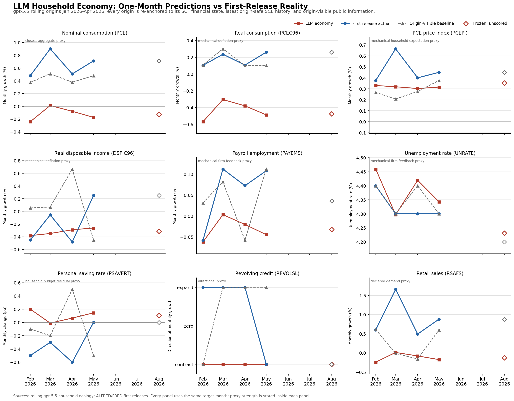

# The Household Economy Runs, But Has Not Added Forecast Signal Yet

The 200-household economy now has a nine-variable predicted-versus-first-release-
actual surface. It makes the mappings and their limits visible. It does not change the
primary result: only executed nominal household consumption has a close aggregate
counterpart, nominal PCE, and the household economy fails there.

Across four retrospective monthly origins (`n=4`), anchor-free nominal consumption
forecasts have RMSE `0.782` percentage points and get one direction right. Their
correlation with first-release PCE is `0.683`, but that is not incremental forecast
evidence: the origin-visible PCE drift supplied to every household has RMSE `0.243`,
correlation `0.974`, and 4/4 direction. The households are systematically too
pessimistic by `0.771` points and generate a little over half the observed
month-to-month variation.

## What The Economy Does

```text
200 anonymized SCE histories + matched SCF household states
                              +
                  public information known at the origin
                              |
                              v
                one isolated GPT-5.5 call per household
                              |
                              v
        beliefs + conditional household policies in nominal dollars
                              |
                              v
              household budgets, credit, and settlement
                              |
                              v
                    population-weighted demand
                              |
                              v
     producer output + inventory -> employment + wages -> family income
                              |
                              v
               fresh period-two household decisions
```

Each historical origin gets the latest SCE observations that would have been public
under a nine-month release lag. The household card includes observed aggregate
spending growth as dated context, but the engine does not add it to the household's
spending before the model acts. GPT-5.5 returns signed dollar changes in committed
spending, discretionary spending, one-off purchases, debt repayment, and borrowing.
Code then applies cash, credit, goods, and counterparty constraints.

## Historical Result: Nominal Consumption

| Origin | Target | LLM household economy | First-release PCE | Origin-visible drift |
| --- | --- | ---: | ---: | ---: |
| Jan 2026 | Feb 2026 | -0.24% | +0.48% | +0.37% |
| Feb 2026 | Mar 2026 | +0.01% | +0.90% | +0.51% |
| Mar 2026 | Apr 2026 | -0.08% | +0.51% | +0.38% |
| Apr 2026 | May 2026 | -0.17% | +0.71% | +0.48% |

| Diagnostic | Result |
| --- | ---: |
| Consumption RMSE | 0.782 pp |
| Mean forecast bias | -0.771 pp |
| Demeaned RMSE | 0.126 pp |
| Consumption correlation | 0.683 |
| Forecast/actual standard-deviation ratio | 0.563 |
| Consumption direction | 1/4 |
| Origin-visible drift RMSE | 0.243 pp |
| Origin-visible drift demeaned RMSE | 0.113 pp |
| Origin-visible drift correlation | 0.974 |
| Origin-visible drift direction | 4/4 |
| Revolving-credit direction | 1/4 |
| Settlement audit | PASS |



The households reduce spending in three months when nominal PCE rose in all four, so
their point forecasts are poor. They rank the four months moderately well, but the
visible drift ranks them better (`0.974` correlation versus `0.683`) and also has a
lower demeaned RMSE (`0.113` versus `0.126`). We therefore cannot attribute the timing
pattern to household reasoning. The current household layer transforms stronger public
context into weaker forecasts.

## What The New Panel Shows And Does Not Show

The generated surface compares nine declared model outputs with first-release series
for the same target month. Every retrospective row has `n=4`; the July row is frozen
for August and unscored.

| Model output | Comparator | Retrospective read |
| --- | --- | --- |
| Nominal consumption growth | nominal PCE | closest aggregate proxy; RMSE 0.782 pp, 1/4 direction; the central failure |
| Price growth | PCEPI | household-belief/deflation proxy; RMSE 0.193 pp, 4/4 direction |
| Real consumption growth | real PCE | belief/deflation proxy; RMSE 0.622 pp, 0/4 direction |
| Real disposable income growth | real disposable income | belief/deflation proxy; RMSE 0.313 pp, 3/4 direction |
| Payroll growth | PAYEMS | target-month producer-plan proxy using origin inventory; score regenerated below |
| Unemployment-rate level | UNRATE | target-month producer-plan proxy using origin inventory; score regenerated below |
| Saving-rate change | PSAVERT | gross household budget-residual proxy; RMSE 0.510 pp, 1/4 direction |
| Revolving-credit growth | revolving credit | direction-only proxy; 1/4 direction, no level-error score |
| Retail-sales growth | retail sales | declared demand proxy; RMSE 1.103 pp, 1/4 direction |

PCEPI, real consumption, and real income are constructed from household beliefs and
deflation; they are not independent validated forecasts. Payroll and unemployment come
from a target-month plan based on predicted demand and origin inventory, not an estimated
labor market. The saving row is
not a national-accounts saving identity. Retail reuses executed spending as a declared
demand proxy. Credit is explicitly direction-only. The panel is useful because it
separates these objects rather than letting a single consumption chart obscure them; it
does not establish that any proxy mapping is an empirical macro model.

## Why The Previous Result Changed

V22 began each household at a spending level that already incorporated the latest
aggregate PCE growth. The LLM then adjusted that pre-grown level. Because household
adjustments were negative in every historical month, the reported positive forecasts
came from the aggregate anchor, not from bottom-up household behavior.

V23 removes the anchor from execution. Households start from recurring committed and
discretionary dollar levels; aggregate consumption growth is information they may use,
not a number the engine silently carries forward. This is the first period-by-period
chart that cleanly answers whether the households themselves generate the forecast.

## Household State And Monthly Transition

SCE histories now update by origin rather than freezing every run at the same two
waves. The materializer includes an observation only once its event date and public
availability date are both safe for that origin. Missing later answers do not erase a
household's latest valid field-level prior.

The monthly transition carries settled deposits, debt, committed spending, and
discretionary spending. One-off purchases remain one-off. Producer wage and income
feedback updates the next household state, and the same policy schema is used in
rolling and recursive runs.

## Frozen August Panel Row And Recursive Trace

The frozen July origin predicts **-0.13%** nominal consumption growth for August.
Its weighted household actions add about `$10.80` to committed spending, subtract
`$30.34` from discretionary spending, add no one-off purchase, repay `$19.49` of
extra debt, and borrow `$45.08` per represented household. August is unscored.

Starting from that economy, a fresh period-two call for every household produces a
further **0.31% fall** in consumption. Producer output, employment, and wages barely
move because the aggregate demand change is small. This is a verified state transition,
not a September forecast or an estimate of the causal value of feedback.

## Integrity Record

- Final published runs replay 200 current, 800 historical, and 200 period-two cached
  Codex CLI payloads with no fresh calls. Retained accepted-call journals match 200/200
  current and 200/200 period-two payloads, but only 309/800 historical payloads. The
  remaining historical cache records are hash-bound and replayable, but no retained
  journal independently proves their original provider attempt.
- Prompt cards contain no realized targets. Historical cards expose only household
  observations and public information available at each origin.
- The household-history manifest and public history file are hash-bound into every
  run; raw SCE respondent identifiers never enter public artifacts.
- Recurring spending, deposits, debt, inventory, employment, wages, and income cross
  the monthly boundary through one canonical transition.
- Household budgets, goods inventory, bank stocks, and named counterparty flows
  reconcile at numerical tolerance. A firm balance sheet and full external sector are
  outside this version.

## Where This Leaves The Project

The architecture is now honest enough to diagnose. Survey data supplies household
heterogeneity, the LLM writes state-dependent policies, settlement creates aggregate
demand, and demand feeds back into income before the next decision. The first clean
historical test says this object does not yet improve on the information in its own
prompt.

The next work is narrower than adding more agents. We need a better household spending
state and a better elicitation of ordinary nominal inertia. The current SCF-conditioned
"typical month" is not the same thing as each household's actual previous-month
expenditure, and the model responds to uncertainty with broad discretionary cuts. Those
two effects can explain the level shift without changing the economy's structure.

January-April remains retrospective development evidence (`n=4` for each panel
variable). The July panel row stays frozen and unscored until the August realizations
arrive.
