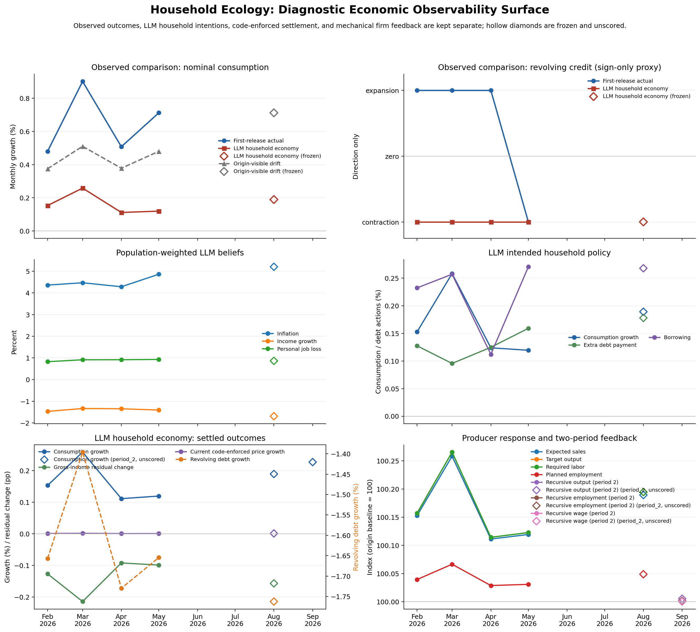

# The Household Economy Now Gets the Direction Right

Two hundred GPT-5.5 households now get all four historical consumption directions
right. Their RMSE falls from `0.701` to `0.508` percentage points after replacing
the prudent-depositor interface with state-conditioned household budgets. That is
the best result from the current household architecture, but it is not yet a good
macro forecast: every increase is too small, and a simple origin-visible spending
drift still scores much better at `0.243` points.

The second result is structural. Household demand now changes a producer's output,
inventory, aggregate employment, wages, and family income; the same households
then decide again from the simulated state. We have a short-run LLM household
economy rather than a set of disconnected household forecasts.

## The Economy

```text
200 anonymized SCE histories + matched SCF household states
                              +
                  public information known at the origin
                              |
                              v
                one isolated GPT-5.5 call per household
                              |
                              v
        beliefs + conditional household policies in nominal dollars
                              |
                              v
              enforced budgets, credit, and settlement
                              |
                              v
                    population-weighted demand
                              |
                              v
     producer output + inventory -> employment + wages -> family income
                              |
                              v
               fresh period-two household decisions
```

The producer is not another role-playing model. Prior demand sets expected sales;
the producer closes 35% of its inventory gap, 25% of its aggregate labor gap, and
10% of the employment-rate change into wages, capped at 2% per month. Respondent
job labels remain fixed because the data identify family earnings, not which family
member gains or loses hours.

## Historical Diagnostic

| Origin | Target | LLM household economy | First-release PCE | Origin-visible drift |
| --- | --- | ---: | ---: | ---: |
| Jan 2026 | Feb 2026 | +0.15% | +0.48% | +0.37% |
| Feb 2026 | Mar 2026 | +0.26% | +0.90% | +0.51% |
| Mar 2026 | Apr 2026 | +0.11% | +0.51% | +0.38% |
| Apr 2026 | May 2026 | +0.12% | +0.71% | +0.48% |

| Diagnostic | Result |
| --- | ---: |
| Consumption direction | 4/4 |
| Consumption RMSE | 0.508 pp |
| Origin-visible drift RMSE | 0.243 pp |
| Consumption correlation | 0.759 |
| Revolving-credit direction | 1/4 |
| Settlement audit | PASS |



The new household object solves the old sign failure. It also reveals the next
one cleanly: the model predicts roughly the right ordering and direction but only
a fraction of the observed nominal movement. The credit side has not improved.

## What Changed About Saving

The previous prompt asked the LLM for consumption, debt, borrowing, and a deposit
contribution. That overdetermined the household budget. Deposits are now whatever
cash remains after income, spending, debt service, borrowing, and fixed outflows.

The next correction was subtler. A household's total-saving rate cannot be treated
as a checking-account contribution. The current state keeps the total-saving
target but sends only enough toward liquid deposits to close the household's buffer
gap gradually over twelve months. Taxes, recurring obligations, and the rest of
saving sit outside liquid deposits. If matched expenditure exceeds income, the
household keeps an explicit cash deficit instead of being turned into a saver.

Across the cohort, 49.5% of population weight has no baseline liquid-saving target.
The weighted total-saving target is 16.35% of gross household income; the liquid
target is 11.34%, and the actual frozen-run deposit increase is 10.66%. The figure
is still high, but it is now an explicit household-state outcome rather than an
unexplained accounting remainder.

## The Two-Period Result

The frozen July origin predicts **+0.19%** nominal consumption growth for August.
Starting from that period-one economy:

| Dynamic quantity | Period one | Period two |
| --- | ---: | ---: |
| Consumption | $3.116m | $3.123m |
| Output | 3.116m units | 3.116m units |
| Inventory | 248,774 units | 241,909 units |
| Producer employment index | 1.000000 | 1.000013 |
| Producer average-wage index | 1.000000 | 1.000001 |

Fresh period-two household spending rises **0.23%**. Aggregate producer headcount,
the wage bill, and the average wage now move inside settlement rather than appearing
only as planning targets. Period-two opening deposits, debt, and inventory equal
period-one closing stocks.

This is an unscored mechanism trace. It shows that the loop executes and propagates
state. It does not isolate the causal effect of firm feedback because there is no
matched no-feedback household-call arm, and it is not a September forecast.

## Integrity Record

- The v22 campaign banked 1,000 fresh first-period Codex CLI responses: 800
  historical and 200 prospective, with zero provider failures.
- The feedback leg banked 200 fresh period-two responses, also with zero provider
  failures.
- Final published runs are exact replays: 200 current, 800 historical, and 200
  period-two cache hits with zero new calls.
- Prompt cards contain no realized targets. Period two reuses origin-safe public
  information and adds only separately labelled simulated producer state.
- The feedback replay verifies every consumed parent artifact plus the household
  and history input hashes.
- Household budgets, goods inventory, deposit and debt stocks, and named
  counterparty flows reconcile at numerical tolerance. A firm balance sheet and
  full external-sector stocks are not modeled.

## So What

The natural-household redesign worked in the specific way we needed first: the
aggregate now moves in the right direction period by period. The economy can also
run forward one step with demand, production, labor income, and household decisions
connected.

The remaining problem is no longer architecture or sign. It is amplitude. These
households recognize expansion but spend too cautiously, and their revolving-credit
choices remain unrealistic. The next work belongs in the state-to-policy interface,
especially the mapping from recent nominal spending, liquidity, income, and beliefs
to committed and discretionary dollars. It does not require LLM firms or banks.

January-April remains retrospective development evidence and may be in model
knowledge. August is the untouched prospective score.
